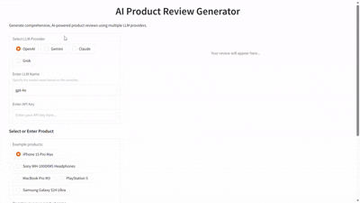

# AI Product Review Generator

AI Product Review Generator is an advanced, multi-agent system for generating comprehensive, unbiased product reviews using the [Agno framework](https://github.com/agno-agi/agno). It supports leading LLM providers including **OpenAI**, **Gemini**, **Claude**, and **Grok**.

## Features

- **Multi-Agent Workflow:** Orchestrates research, content extraction, and review writing using specialized agents.
- **Provider Flexibility:** Easily switch between OpenAI, Gemini, Claude, and Grok models.
- **Research Driven Reviews:** Finds, evaluates, and cites authoritative sources including user reviews, specifications, and expert opinions.
- **Content Scraping:** Extracts and summarizes product information from multiple sources.
- **Gradio UI:** Simple web interface for generating and viewing product reviews.

## Getting Started

### 1. Clone/Copy the Repository

### 2. Get API Keys

You'll need an API key from at least one LLM provider:

- **OpenAI:** <https://platform.openai.com/api-keys>
- **Google Gemini:** <https://aistudio.google.com/apikey>
- **Anthropic Claude:** <https://console.anthropic.com/>
- **xAI Grok:** <https://console.x.ai/>

### 3. Run the App

```bash
python app.py
```

The Gradio interface will launch and display a local URL (usually `http://127.0.0.1:7860`). 
Open this URL in your browser.


## Usage

1. Select your preferred LLM provider and model.
2. Enter your API key.
3. Choose an example product or enter your own.
4. Click **Generate Review** to create a comprehensive product review.

## Example Products

- iPhone 15 Pro Max
- Sony WH-1000XM5 Headphones
- MacBook Pro M3
- PlayStation 5
- Samsung Galaxy S24 Ultra

## Project Structure

```
.
├── app.py                              # Gradio web app
├── src/
│   └── ai_product_review_generator/
│       ├── agents.py                   # Agent definitions
│       ├── generator.py                # Product review generation workflow
│       ├── model.py                    # LLM model (OpenAI, Gemini, Claude, Grok)
│       ├── response_model.py           # Pydantic models for responses
│       └── utils.py                    # Utilities
├── pyproject.toml                      # Project dependencies
├── README.md
└── LICENSE
```

## How It Works

1. **Research Agent** searches for product information, reviews, and specifications
2. **Scraper Agent** extracts detailed content from relevant sources
3. **Review Writer Agent** analyzes all gathered information and creates a comprehensive, balanced review

## Technologies Used

- **Agno Framework:** Multi-agent orchestration
- **Gradio:** Web interface
- **DuckDuckGo Search:** Web search functionality
- **Newspaper4k:** Article extraction and scraping
- **Pydantic:** Data validation
- **Multiple LLM Support:** OpenAI, Gemini, Claude, Grok

## Demo



## Troubleshooting

### Port Already in Use
If you see an error about port 7860 being in use:
```bash
python app.py --server-port 7861
```

### API Key Issues
- Double-check your API key is correct
- Ensure you have credits/quota available on your LLM provider account
- Some providers may require billing information to be set up

## Contributing

We welcome contributions from the community! If you have an addition or improvement to suggest:

1. Fork the repository
2. Create your feature branch: `git checkout -b feature/AmazingFeature`
3. Commit your changes: `git commit -m 'Add some AmazingFeature'`
4. Push to the branch: `git push origin feature/AmazingFeature`
5. Open a pull request

## License

This project is licensed under [MIT License](LICENSE).

---

⭐️ If you find this repository helpful, please consider giving it a star!

**Keywords:** AI, Machine Learning, Generative AI, LLM, AI Agents, Agentic AI, Agno, Product Reviews, Multi-Agent System

